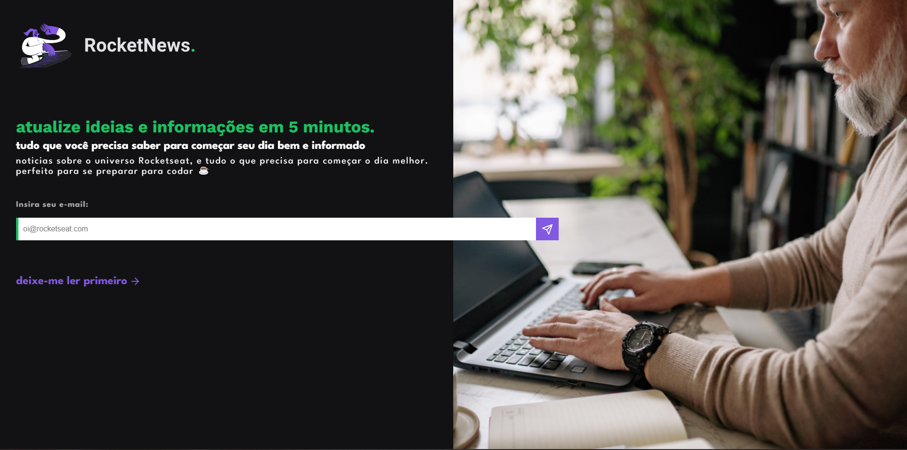

<h1 align="center">
    
</h1>
  

    
  

  

  Desafio promovido pela Rocketseat para ensino de tecnologias WEB.
  

  

    <a href="#-tecnologias">Tecnologias</a>&nbsp;&nbsp;&nbsp;|&nbsp;&nbsp;&nbsp;
    <a href="https://rafael-malaquias.github.io/">Projeto</a>&nbsp;&nbsp;&nbsp;|&nbsp;&nbsp;&nbsp;
    <a href="#-layout">Layout</a>&nbsp;&nbsp;&nbsp;|&nbsp;&nbsp;&nbsp;
    <a href="#memo-licença">Licença</a>
  

  

    
  

 

## 🚀 Tecnologias

Esse projeto foi desenvolvido com as seguintes tecnologias:

- HTML e CSS
- Git e Github
- Figma

## 💻 Projeto

O RocketNews é um Alerta de Noticías para começar seu dia bem e informado.

[Link](https://rafael-malaquias.github.io//) - Para visualizar o projeto.

## 🔖 Layout

Você pode visualizar o layout do projeto através [DESSE LINK](https://www.figma.com/file/5WaCBJSrj4O8IxhqkQp3Hw/RocketNews-%E2%80%A2-Desafio-Discover-(Community)?mode=dev) para acessá-lo.

##  📝 Licença

Esse projeto está sob a licença MIT.

---